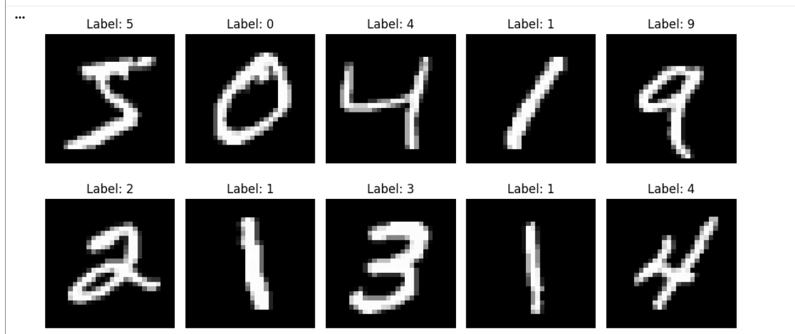
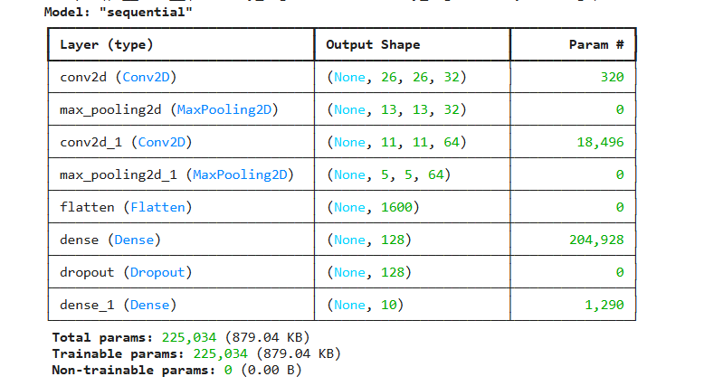
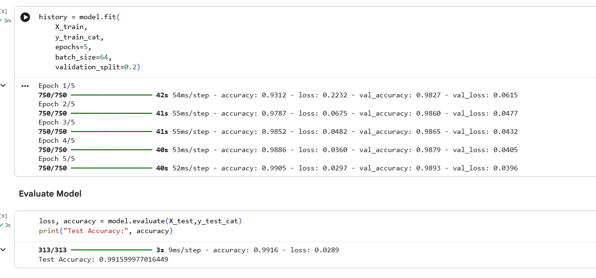
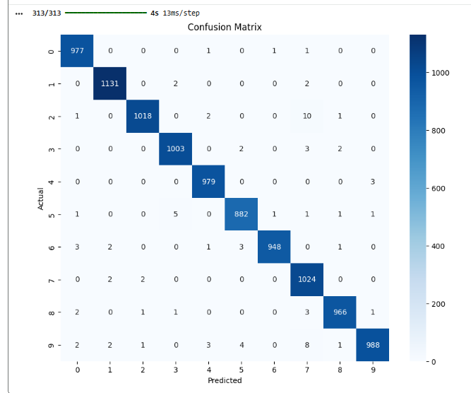
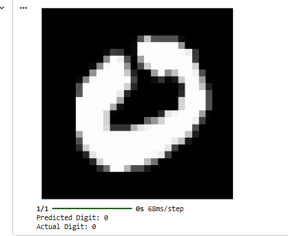

# ✍️ Handwritten Character Recognition using CNN

## 📌 Project Overview

This project implements a Convolutional Neural Network (CNN) to recognize handwritten digits using the MNIST dataset. The model learns patterns from handwritten digit images and accurately classifies digits from 0 to 9.

---

## 🎯 Objective

To develop a deep learning model capable of recognizing handwritten characters with high accuracy.

---

## 📊 Dataset Information

### MNIST Handwritten Digits Dataset

- Total Images: 70,000
- Training Images: 60,000
- Testing Images: 10,000
- Image Size: 28 × 28 Pixels
- Classes: 10 (Digits 0–9)

---

## 🧠 Deep Learning Model

A Convolutional Neural Network (CNN) was used consisting of:

- Convolution Layers
- Max Pooling Layers
- Flatten Layer
- Dense Layers
- Dropout Layer

---

## 🔄 Project Workflow

1. Load MNIST Dataset
2. Data Preprocessing
3. CNN Model Creation
4. Model Training
5. Model Evaluation
6. Digit Prediction
7. Performance Analysis

---

## 📈 Evaluation Metrics

- Accuracy
- Confusion Matrix
- Classification Report

---

## 📷 Project Screenshots

### Sample Digits

### CNN Model Summary

### Training Accuracy

### Confusion Matrix

### Prediction Output

---

## 🏆 Results

The CNN model successfully learned handwritten digit patterns and achieved excellent classification performance on the MNIST dataset.

The model demonstrated high accuracy in recognizing handwritten digits from 0 to 9 and produced reliable predictions on unseen test images.

---

## 🚀 Technologies Used

- Python
- TensorFlow
- Keras
- NumPy
- Matplotlib
- Scikit-Learn

---

## 👩‍💻 Author

Lakshmi Swapna Chandaluri

CodeAlpha Machine Learning Internship
